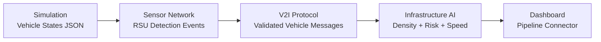

# Highway-V2I System Pipeline

This document defines the first working cross-repository Highway-V2I pipeline and the module handoff contracts between repositories.

## Pipeline Modules

1. **Simulation Data Generator** (`zayvora-sim-lab/simulations/corridor_simulation.py`)
2. **Sensor Network Receiver** (`zayvora-sensor-net/communication/corridor_receiver.py`)
3. **V2I Protocol Router** (`zayvora-protocol-lab/protocol/v2i_message_router.py`)
4. **Infrastructure AI Analyzer** (`zayvora-infrastructure-ai/algorithms/traffic_optimizer.py`)
5. **Dashboard Connector** (`zayvora-highway-v2i/backend/pipeline_connector.py`)

## Data Flow



## Contract Summary

- **Simulation output** contains `vehicle_id`, `speed`, `position`, `lane`, and `acceleration`.
- **Sensor events** contain `rsu_id`, `vehicle_id`, and `signal_strength`.
- **Protocol messages** contain `type`, `vehicle_id`, `rsu`, and `latency`.
- **AI metrics** contain `traffic_density`, `risk_score`, and `recommended_speed`.
- **Dashboard state** aggregates stream counts and AI recommendation snapshots for visualization.

## Demo Execution

After cloning target repositories as sibling directories, run the scaffolder from this repository root:

```bash
node scripts/scaffold/zayvora-pipeline.js
```

Then execute the demo in the simulation repository:

```bash
python run_demo_pipeline.py
```
