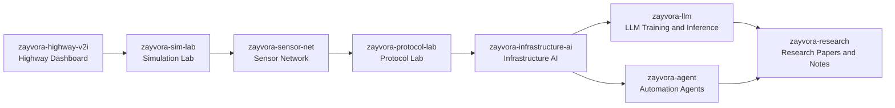

# Zayvora AI Infrastructure Research Ecosystem

This document defines how the target Zayvora repositories are intended to integrate into a unified research and development pipeline.

## Repository Interaction Flow

## Integration Notes

- **Highway Dashboard (`zayvora-highway-v2i`)** provides visualization surfaces and operator-facing controls.
- **Simulation Lab (`zayvora-sim-lab`)** runs traffic and corridor simulation outputs consumed by the dashboard.
- **Sensor Network (`zayvora-sensor-net`)** models RSU + IoT field inputs and signal reliability.
- **Protocol Lab (`zayvora-protocol-lab`)** validates transport and message format behavior under simulation conditions.
- **Infrastructure AI (`zayvora-infrastructure-ai`)** applies optimization and prediction over simulation + sensor + protocol telemetry.
- **LLM (`zayvora-llm`)** supports model-assisted orchestration and local model experimentation.
- **Agent (`zayvora-agent`)** automates repo operations, experiment execution, and report assembly.
- **Research (`zayvora-research`)** consolidates architecture papers, experiment logs, and publication drafts.

## Suggested Cross-Repo Contracts

1. Shared JSON schemas for telemetry, scenario configuration, and protocol messages.
2. Versioned baseline datasets published from `zayvora-sim-lab` into `zayvora-research`.
3. Standard experiment metadata emitted by `zayvora-agent` workflows and archived into `zayvora-research/notes`.
4. Repeatable benchmark pipeline connecting `zayvora-sensor-net` and `zayvora-infrastructure-ai`.
