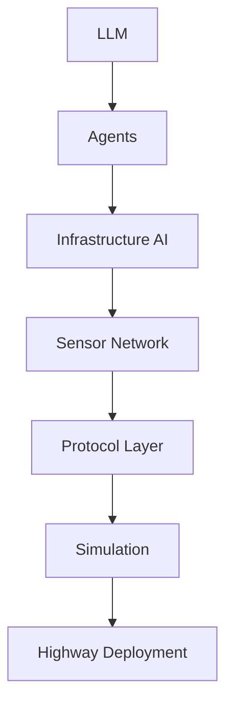

# Zayvora Ecosystem Architecture

This document provides a central architecture view of the Zayvora ecosystem across research, intelligence, simulation, and deployment experimentation repositories.

## Layered Architecture Overview

### Layer 1: AI Core

**Repositories:**
- `zayvora-llm`
- `zayvora-agent`

The AI Core is the cognitive foundation of the ecosystem:
- `zayvora-llm` provides model-level reasoning, planning, generation, and domain adaptation capabilities.
- `zayvora-agent` operationalizes the model into agent workflows, orchestration behaviors, and task execution loops.

Together, these repositories form the decision and autonomy substrate that drives higher layers.

### Layer 2: Infrastructure Intelligence

**Repositories:**
- `zayvora-infrastructure-ai`
- `zayvora-sensor-net`
- `zayvora-protocol-lab`

This layer connects AI cognition to physical/digital infrastructure signals:
- `zayvora-infrastructure-ai` transforms agent outputs into infrastructure-aware intelligence and control recommendations.
- `zayvora-sensor-net` ingests and normalizes sensor telemetry from distributed environments.
- `zayvora-protocol-lab` defines and validates communication, interoperability, and control protocols between systems.

This layer serves as the bridge between autonomous reasoning and operational environment constraints.

### Layer 3: Simulation

**Repository:**
- `zayvora-sim-lab`

Simulation is the ecosystem validation and scenario engine:
- `zayvora-sim-lab` models systems, traffic/infrastructure dynamics, protocol behavior, and agent-policy interactions before real-world rollout.

It is the primary risk-reduction stage for testing hypotheses and stress conditions safely.

### Layer 4: Deployment Experiments

**Repository:**
- `zayvora-highway-v2i`

Deployment Experiments operationalize validated simulation outputs in controlled real-world pilots:
- `zayvora-highway-v2i` executes Vehicle-to-Infrastructure (V2I) experiments, gathers field metrics, and closes the learning loop back into upstream layers.

## End-to-End Flow

## Repository Responsibility Map

| Layer | Repository | Primary Responsibility |
|---|---|---|
| Layer 1: AI Core | `zayvora-llm` | Foundation model intelligence and reasoning |
| Layer 1: AI Core | `zayvora-agent` | Agent orchestration and autonomous task execution |
| Layer 2: Infrastructure Intelligence | `zayvora-infrastructure-ai` | Infrastructure-aware intelligence and control logic |
| Layer 2: Infrastructure Intelligence | `zayvora-sensor-net` | Sensor ingestion, normalization, and telemetry pipelines |
| Layer 2: Infrastructure Intelligence | `zayvora-protocol-lab` | Protocol design, interoperability, and validation |
| Layer 3: Simulation | `zayvora-sim-lab` | Scenario simulation, system validation, and stress testing |
| Layer 4: Deployment Experiments | `zayvora-highway-v2i` | Real-world V2I deployment experimentation and feedback |

## Architectural Intent

The Zayvora ecosystem is designed as a progressive maturity pipeline:
1. **Reason** in the AI Core.
2. **Contextualize** through Infrastructure Intelligence.
3. **Validate** in Simulation.
4. **Operationalize** in Deployment Experiments.

This layered approach supports safe iteration, measurable performance improvement, and traceable flow from model cognition to field outcomes.
